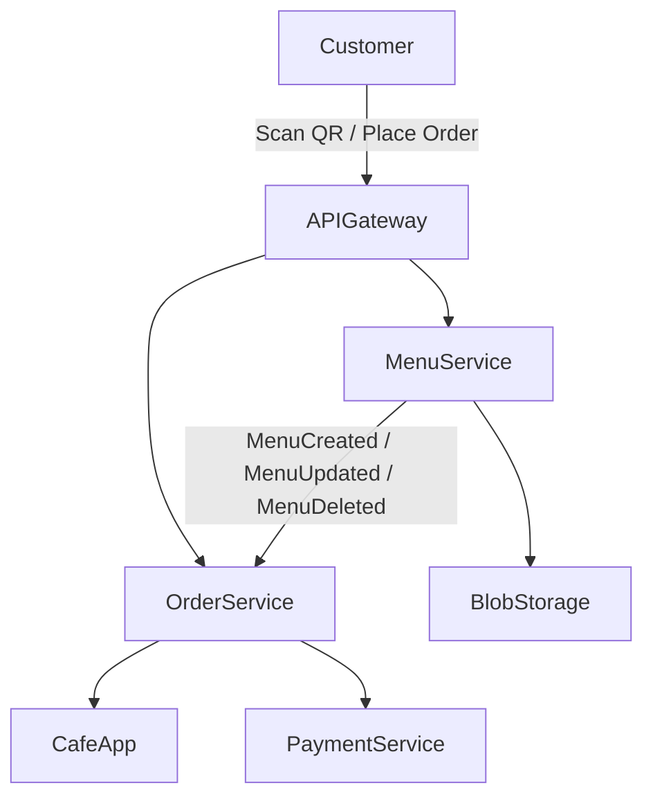

# SmartCafe — Overview

Welcome to **SmartCafe**, a modern, microservices-based application designed for cafes to offer smart ordering and customer interaction.

This document serves as the **high-level domain overview**, including project vision, MVP scope, and system architecture. All domain concepts and business flows are described here; there is no separate domain-overview file.

---

## 1. Vision

SmartCafe aims to simplify ordering and payment processes in cafes, while providing a foundation for future AI-driven recommendations and enhanced customer experiences.

Key goals:

- Customers can view menus and place orders via QR codes or links.
- Cafes can receive and manage orders efficiently.
- System is scalable, cloud-ready, and modular.
- Supports future features such as split payments, AI recommendations, and waiter calls.

---

## 2. MVP Scope

The Minimum Viable Product (MVP) focuses on the Menu Service first, then the Order Service:

- Cafes create and manage digital menus via the Menu Service.
- Customers scan QR code → see menu → create an order.
- Order is sent to the cafe via the Order Service.
- Basic order management by the cafe.
- Menu Service publishes events to Order Service for menu changes.

> Future features like split payments or AI suggestions will be added without rewriting core services.

---

## 3. High-Level Architecture

The system is designed as microservices:

- Menu Service — manages menus for each cafe.
- Order Service — handles customer orders.
- Payment Service (future) — handles payments and split bills.
- API Gateway — central entry point for frontend requests.
- Blob Storage — stores menu images and assets.

### Mermaid Diagram — High-Level System

---

## 4. Documentation Structure

All documentation files are stored in separate folders under the repo root:

- 00-overview           — High-level overview and MVP documentation
- 10-business-domain    — Domain modeling: Orders, Menu, Payments
- 20-architecture       — Architecture diagrams, service communication
- 30-technologies       — Tech stack details and infrastructure
- LICENSE.md            — Apache 2.0 license

---

## 5. Future Features / Roadmap

- Split payments for group orders
- AI-powered dish recommendations
- Waiter call integration
- Analytics for restaurants

---

## 6. Contents

- `glossary.md`: Key terms and definitions
- `mvp.md`: Minimum Viable Product description
- `README.md`: This overview

---

## Audience

- **Business:** Find project goals, terminology, and MVP scope
- **Developers:** Reference for project context and definitions

---

## References

- [Glossary](./glossary.md)
- [MVP](./mvp.md)
- [Business Domain](../10-business-domain/README.md)
- [Architecture](../20-architecture/README.md)
- [Technologies](../30-technologies/README.md)
- [Root README](../README.md)
