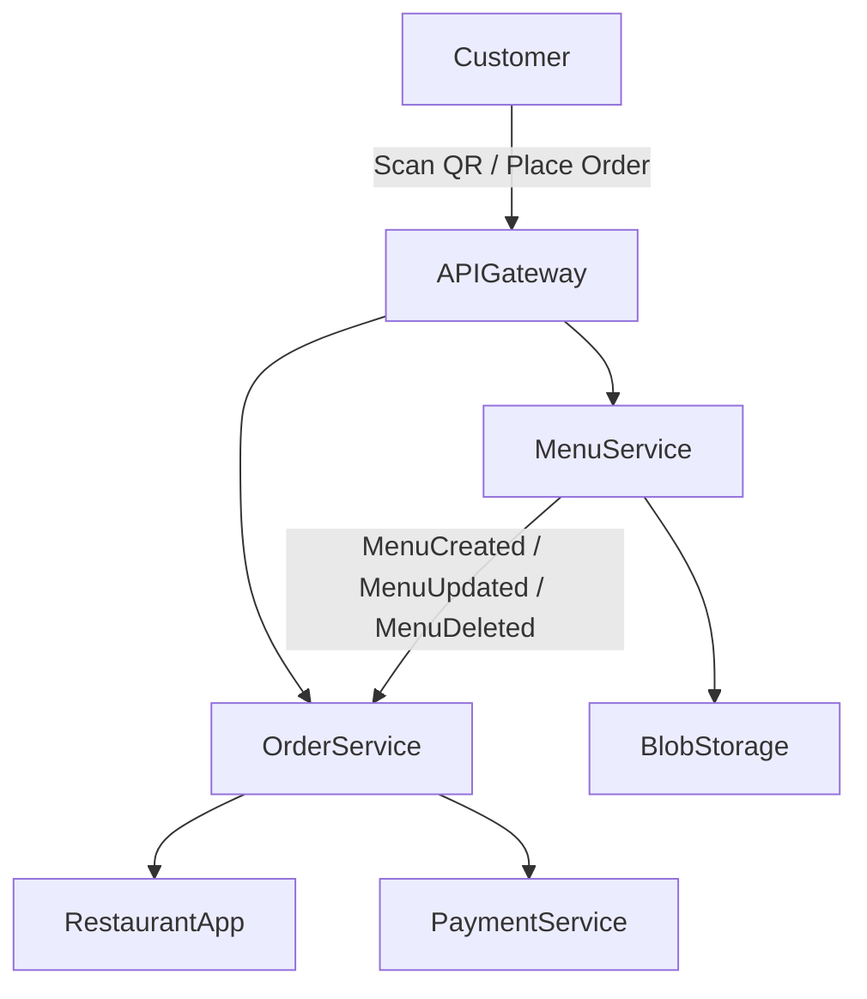

# SmartCafe — Overview

Welcome to **SmartCafe**, a modern, microservices-based application designed for cafes and restaurants to offer **smart ordering and customer interaction**.

This document provides a **high-level overview**, including project vision, MVP scope, and system architecture.

---

## 1. Vision

SmartCafe aims to **simplify ordering and payment processes** in cafes and restaurants, while providing a foundation for **future AI-driven recommendations** and **enhanced customer experiences**.

Key goals:

- Customers can **view menus** and **place orders** via QR codes or links.  
- Restaurants can **receive and manage orders** efficiently.  
- System is **scalable**, **cloud-ready**, and **modular**.  
- Supports **future features** such as split payments, AI recommendations, and waiter calls.

---

## 2. MVP Scope

The **Minimum Viable Product (MVP)** focuses on the **Order Service**:

- Customer scans QR code → sees menu → creates an order.  
- Order is sent to the restaurant via the **Order Service**.  
- Basic order management by the restaurant.  
- **Menu Service** integration is read-only for now.  

> Future features like split payments or AI suggestions will be added without rewriting core services.

---

## 3. High-Level Architecture

The system is designed as **microservices**:

- **Menu Service** — manages menus for each restaurant.  
- **Order Service** — handles customer orders.  
- **Payment Service** (future) — handles payments and split bills.  
- **API Gateway** — central entry point for frontend requests.  
- **Blob Storage** — stores menu images and assets.  

### Mermaid Diagram — High-Level System

## 4. Documentation Structure

All documentation files are stored in separate folders under the repo root:

00-overview           # High-level overview and MVP documentation
10-business-domain    # Domain modeling: Orders, Menu, Payments
20-architecture       # Architecture diagrams, service communication
30-technologies       # Tech stack details and infrastructure
LICENSE.md            # Apache 2.0 license

## 5. Future Features / Roadmap

- **Split payments** — allow groups to pay individually.
- **AI agent for recommendations** — suggest dishes based on preferences.
- **Waiter call integration** — customer can request service.
- **Analytics for restaurants** — track popular items, peak hours.

## 6. References

- [`MVP Details`](./mvp.md)
- [Business Domain Overview](../10-business-domain/domain-overview.md)
- [System Architecture](../20-architecture/system-architecture.md)
- [Technologies](../30-technologies/backend.md)
