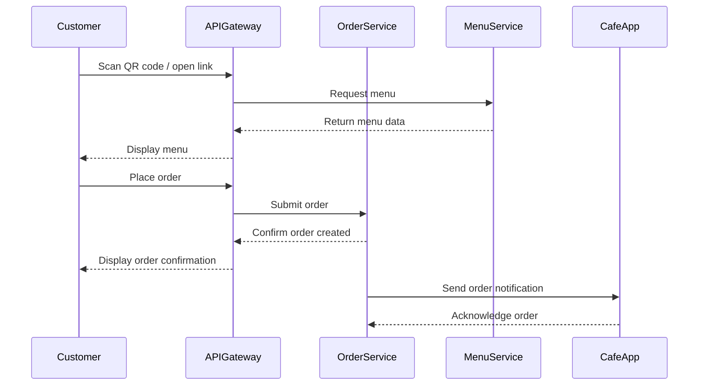

# SmartCafe — MVP (Minimum Viable Product)

This document describes the **Minimum Viable Product (MVP)** for SmartCafe. The MVP focuses on the **Order Service** and its interaction with other services, providing a foundation for future enhancements.

---

## 1. MVP Goals

- Allow customers to **scan a QR code** or follow a link to view a menu.
- Enable customers to **place orders** directly to the cafe.
- Ensure cafes can **receive and manage orders** efficiently.
- Provide a **scalable microservices architecture** that supports future features:
  - Split payments for group orders
  - AI-powered dish recommendations
  - Waiter call integration

---

## 2. Core Services in MVP

### 2.1 Order Service

- Handles **incoming customer orders**.
- Stores order details: items, quantities, customer info, and status.
- Maintains **order lifecycle**: Pending → Accepted → Preparing → Ready → Delivered → Cancelled.
- Sends **events** to Cafe App and Payment Service (future).
- Provides real-time order status updates to customers.

### 2.2 Menu Service

- Provides **cafe menus** for Order Service.
- Stores menu items, categories (single per item), prices, and images (big/cropped via Blob Storage).
- Menu items have configurable categories (e.g., Vegetarian, Spicy) with optional icons/images.
- Items support ingredient inclusion/exclusion for customization.
- In MVP, Menu Service is **read-only** for customers; admin menu editing comes later.

### 2.3 API Gateway

- Single entry point for frontend requests.
- Routes requests to Order Service and Menu Service.

---

## 3. MVP Flow — Customer Perspective

---

## 4. Data Flow & Order → Menu Link

- Each **order references a cafe menu** by `menuId`.
- Menu items are **immutable at the time of order** to prevent inconsistencies.
- Future updates to menu (prices, images) will **not affect existing orders**.

**Entities (MVP):**

- `Order`: id, customerId, cafeId, tableId, menuId, items[], status
- `Menu`: id, cafeId, items[]
- `Item`: id, name, price, categories[], image URLs, ingredient options

> See [Business Domain Overview](../10-business-domain/README.md) for detailed entity definitions.

---

## 5. Notes for Future Features

- **Split Payments:**
  - Orders can later be divided into sub-orders per customer.
  - Design MVP with **order items and customer reference** to avoid rewriting core service.

- **AI Recommendations:**
  - Add recommendation service consuming Menu Service data.
  - Integration via **events** to avoid blocking MVP flow.

- **Waiter Call:**
  - Can be implemented as a separate service with notifications to restaurant staff.

---

## 6. References

- [High-Level Overview](README.md)
- [Business Domain Overview](../10-business-domain/README.md)
- [System Architecture](../20-architecture/README.md)
- [Technologies](../30-technologies/README.md)
