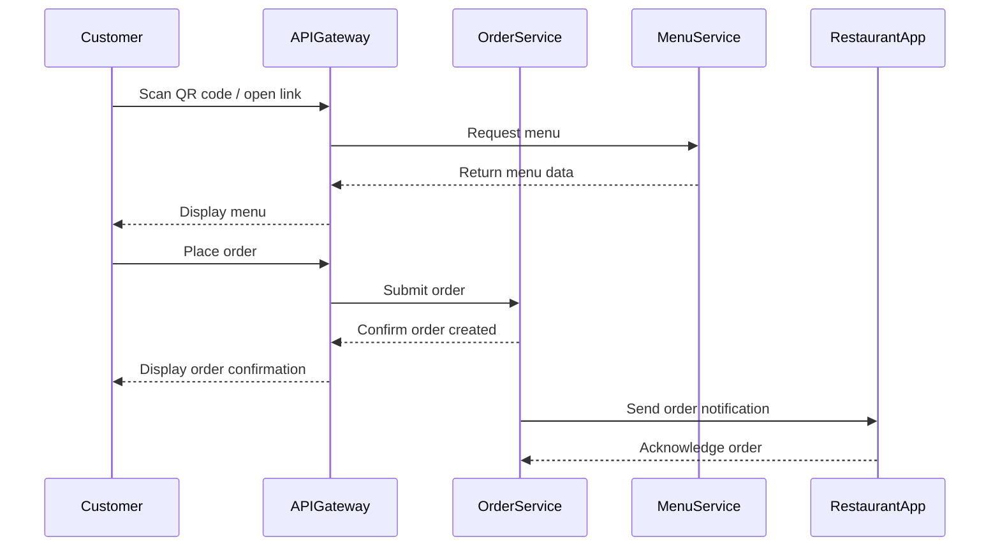

# SmartCafe — MVP (Minimum Viable Product)

This document describes the **Minimum Viable Product (MVP)** for SmartCafe.  
The MVP focuses on the **Order Service** and its interaction with other services, providing a foundation for future enhancements.

---

## 1. MVP Goals

- Allow customers to **scan a QR code** or follow a link to view a menu.  
- Enable customers to **place orders** directly to the restaurant.  
- Ensure restaurants can **receive and manage orders** efficiently.  
- Provide a **scalable microservices architecture** that supports future features like:
  - Split payments for group orders  
  - AI-powered dish recommendations  
  - Waiter call integration  

---

## 2. Core Services in MVP

### 2.1 Order Service

- Handles **incoming customer orders**.  
- Stores order details: items, quantities, customer info, and status.  
- Sends **notifications/events** to Restaurant App and Payment Service (future).  
- Maintains **order lifecycle**: Created → Confirmed → Completed.

### 2.2 Menu Service

- Provides **restaurant menus** for Order Service.  
- Stores menu items, categories, prices, and images (via Blob Storage).  
- In MVP, Menu Service is **read-only** for customers; admin menu editing comes later.

### 2.3 API Gateway

- Single entry point for frontend requests.  
- Routes requests to Order Service and Menu Service.

---

## 3. MVP Flow — Customer Perspective

## 4. Data Flow & Order → Menu Link

- Each **order references a restaurant menu** by `menuId`.  
- Menu items are **immutable at the time of order** to prevent inconsistencies.  
- Future updates to menu (prices, images) will **not affect existing orders**.

**Entities (MVP)**:

- `Order`: id, customerId, restaurantId, menuId, items[], status  
- `Menu`: id, restaurantId, items[]  
- `Item`: id, name, price, optional image URL  

> See [Business Domain Overview](../10-business-domain/domain-overview.md) for detailed entity definitions.

---

## 5. Notes for Future Features

- **Split Payments:**  
  - Orders can later be divided into sub-orders per customer.  
  - Design MVP with **order items and customer reference** to avoid rewriting core service.

- **AI Recommendations:**  
  - Add recommendation service consuming Menu Service data.  
  - Integration via **events** to avoid blocking MVP flow.

- **Waiter Call:**  
  - Can be implemented as a separate service with notifications to restaurant staff.

---

## 6. References

- [High-Level Overview](README.md)  
- [Business Domain Overview](../10-business-domain/domain-overview.md)  
- [System Architecture](../20-architecture/system-architecture.md)  
- [Technologies](../30-technologies/backend.md)
