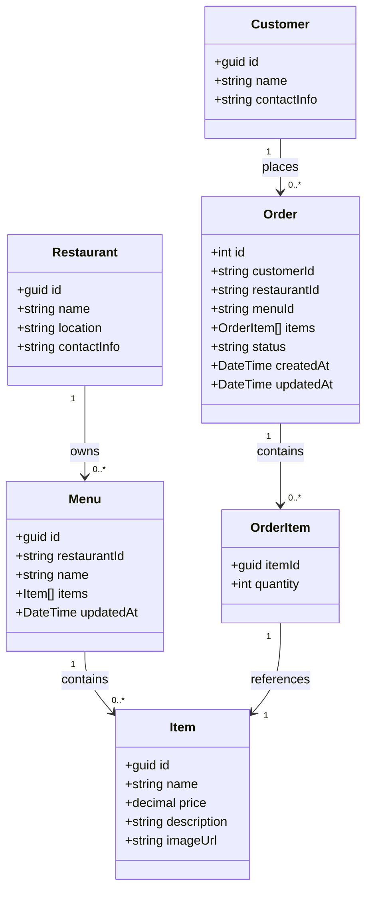
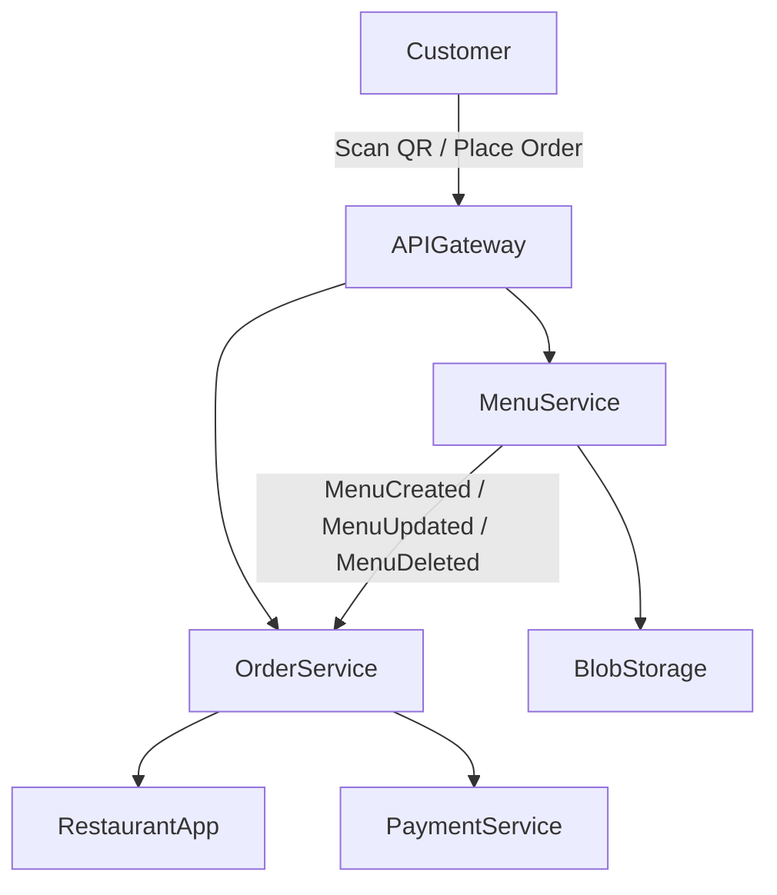

# SmartCafe — Business Domain Overview

This document describes the **business domain** of SmartCafe using a **DDD-lite approach**.  
It provides a foundation for all services, entities, and events in the system.

---

## 1. Domain Approach

- Each **microservice owns its entities** and publishes events for other services.  
- Order Service and Menu Service are **loosely coupled** via events.  
- Entities are **designed for future features** like split payments, AI recommendations, and waiter calls.  
- DDD-lite is applied: we focus on **bounded contexts, entities, and events** without overcomplicating aggregates for MVP.

---

## 2. Core Entities

### 2.1 Order

- `id`: unique order identifier  
- `customerId`: reference to customer  
- `restaurantId`: reference to restaurant  
- `menuId`: reference to the menu used  
- `items[]`: list of ordered items  
- `status`: Created / Confirmed / Completed  
- `createdAt`, `updatedAt`: timestamps

### 2.2 Menu

- `id`: unique menu identifier  
- `restaurantId`: reference to restaurant  
- `items[]`: list of menu items  
- `name`: menu name or category  
- `updatedAt`: timestamp

### 2.3 Item

- `id`: unique item identifier  
- `name`: item name  
- `price`: item price  
- `description`: optional  
- `imageUrl`: optional image of item  

### 2.4 Customer

- `id`: unique identifier  
- `name`  
- `contactInfo`: optional (email, phone)  

### 2.5 Restaurant

- `id`: unique identifier  
- `name`  
- `location`: optional metadata  
- `contactInfo`: optional  

---

## 3. Service Ownership

| Service        | Entities Owned                 | Events Published                       |
|----------------|-------------------------------|---------------------------------------|
| Menu Service   | Menu, Item                     | MenuCreated, MenuUpdated, MenuDeleted |
| Order Service  | Order                          | OrderCreated, OrderConfirmed          |
| Payment Service (future) | Payment               | PaymentProcessed                       |

> Each service is the **single source of truth** for its entities. Events are used to synchronize or notify other services.

---

## 4. Domain Events

- **MenuCreated**: new menu available  
- **MenuUpdated**: menu changed (items, prices, description)  
- **MenuDeleted**: menu removed  
- **OrderCreated**: new order placed by customer  
- **OrderConfirmed**: restaurant confirmed order  
- **PaymentProcessed**: payment completed (future)

> Events should be **immutable** and **append-only** for reliable integration.

---

## 5. Domain Diagram

