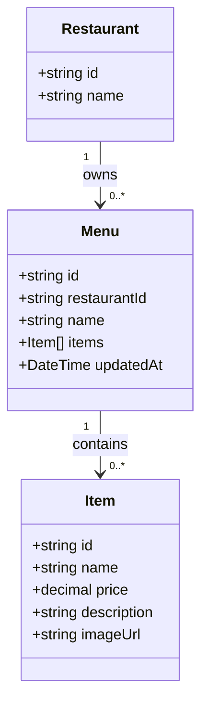

# SmartCafe — Menu Service

This document describes the **Menu Service**, which manages restaurant menus.  It defines entities, events, and API endpoints for the MVP.

---

## 1. Service Overview

**Responsibilities:**

* Store menus and menu items for restaurants.
* Provide menu data to Order Service via API or events.
* Maintain menu versions and timestamps.
* Store menu images in Blob Storage.

**Events Published:**

* `MenuCreated` — triggered when a new menu is added.
* `MenuUpdated` — triggered when a menu or its items are updated.
* `MenuDeleted` — triggered when a menu is removed.

**Dependencies:**

* **Blob Storage** — for storing images.
* **Order Service** — subscribes to menu events.

---

## 2. Core Entities



**Entity Descriptions:**

* **Menu**: Stores menu metadata, restaurantId, items, and updatedAt timestamp.
* **Item**: Contains item name, price, description, and optional imageUrl.

**Relationships:**

* `Menu` belongs to a `Restaurant`.
* `Menu` contains multiple `Item`s.

---

## 3. API Endpoints

### 3.1 Get Menu

GET /menus/{restaurantId}

**Response:**

```json
{
  "menuId": "string",
  "restaurantId": "string",
  "name": "Lunch Menu",
  "items": [
    { "itemId": "string", "name": "Cappuccino", "price": 3.5, "imageUrl": "string" }
  ],
  "updatedAt": "2025-11-15T00:00:00Z"
}
```

### 3.2 Create / Update / Delete Menu

> These endpoints are **admin-only**, for restaurants to manage menus.
> They will trigger corresponding events (`MenuCreated`, `MenuUpdated`, `MenuDeleted`).

---

## 4. Future Enhancements

* Menu versioning for historical orders.
* AI recommendations for customers.
* Dynamic menu pricing and promotions.

---

## 5. References

* [Business Domain Overview](./domain-overview.md)
* [High-Level System Overview](../00-overview/README.md)
