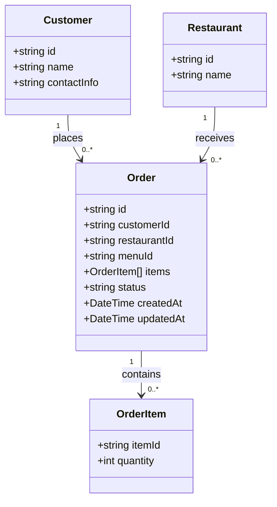

# SmartCafe — Order Service

This document describes the **Order Service**, which handles customer orders for SmartCafe.  It defines entities, events, and API endpoints for the MVP.

---

## 1. Service Overview

**Responsibilities:**

* Accept customer orders via API Gateway.
* Validate orders against the menu (Menu Service data).
* Maintain order lifecycle: `Created` → `Confirmed` → `Completed`.
* Notify Restaurant App about new orders.
* Publish events for other services to consume.

**Events Published:**

* `OrderCreated` — triggered when a new order is placed.
* `OrderConfirmed` — triggered when the restaurant confirms an order.

**Dependencies:**

* **Menu Service** — to validate menu items and prices.
* **Restaurant App** — to notify staff.
* **Payment Service** (future) — for payment processing.

---

## 2. Core Entities



**Entity Descriptions:**

* **Order**: Stores order metadata, customer info, menuId, status, and timestamps.
* **OrderItem**: Tracks individual items in an order (itemId + quantity).

**Relationships:**

* `Order` references `Customer` and `Restaurant` (read-only).
* `Order` contains multiple `OrderItem`s.

---

## 3. API Endpoints

### 3.1 Create Order

```text
POST /orders
```

**Request Body:**

```json
{
  "customerId": "string",
  "restaurantId": "string",
  "menuId": "string",
  "items": [
    { "itemId": "string", "quantity": 1 }
  ]
}
```

**Response:**

```json
{
  "orderId": "string",
  "status": "Created",
  "createdAt": "2025-11-15T00:00:00Z"
}
```

### 3.2 Get Order

```text
GET /orders/{orderId}
```

**Response:**

```json
{
  "orderId": "string",
  "customerId": "string",
  "restaurantId": "string",
  "menuId": "string",
  "items": [
    { "itemId": "string", "quantity": 1 }
  ],
  "status": "Created",
  "createdAt": "2025-11-15T00:00:00Z",
  "updatedAt": "2025-11-15T00:00:00Z"
}
```

### 3.3 Update Order Status

```text
PATCH /orders/{orderId}/status
```

**Request Body:**

```json
{
  "status": "Confirmed"
}
```

---

## 4. Future Enhancements

* Split payments per customer.
* Integration with AI recommendation service.
* Waiter call notifications.
* Payment service integration.

---

## 5. References

* [Business Domain Overview](./domain-overview.md)
* [High-Level System Overview](../00-overview/README.md)
