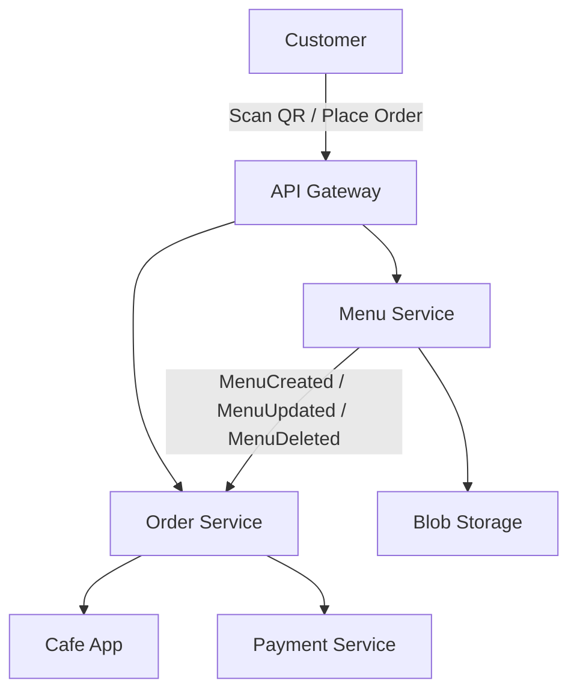

# SmartCafe — Technical Architecture Overview

This document provides a technical overview of the SmartCafe system, including microservices architecture, service interactions, deployment, and key technology choices.

---

## System Architecture

SmartCafe is built as a set of microservices deployed on Azure Kubernetes Service (AKS). The main services are:

- **Menu Service** — Manages menus for each cafe, including sections, items, categories, and images.
- **Order Service** — Handles customer orders, order lifecycle, and real-time status updates for cafes.
- **Payment Service** (future) — Manages payments and split bills.
- **API Gateway** — Central entry point for frontend requests, routing to backend services.
- **Blob Storage** — Stores menu images and assets.

---

## Service Interaction Diagram

---

## Deployment Overview

- Current (MVP): Azure App Service for APIs and web app hosting; Azure Blob Storage for images; Azure ServiceBus for events; Azure PostgreSQL or SQL Server for data.
- Desired (Future): Azure Kubernetes Service (AKS) with ACR, Ingress (NGINX), cert-manager, Key Vault CSI Driver, and KEDA for event-driven autoscaling.
- Images and assets are stored in Azure Blob Storage.
- Azure ServiceBus is used for event-driven communication between services.
- Database options: Azure PostgreSQL or SQL Server for persistent data.

---

## Key Technologies

- **Backend:** .NET 10 (Clean Architecture)
- **Frontend:** Angular 20 (Material, Flex Layout)
- **Cloud:** Azure Kubernetes Service (AKS), Azure Blob Storage, Azure ServiceBus
- **Database:** Azure PostgreSQL or SQL Server

---

## References

- [Project Overview](../00-overview/README.md)
- [Business Domain](../10-business-domain/README.md)
- [Technologies](../30-technologies/README.md)
