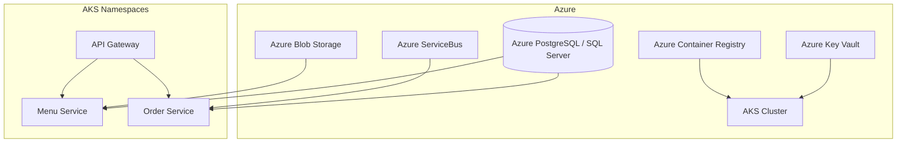

# AKS Desired State — SmartCafe

This document describes the desired (future) deployment state for SmartCafe on Azure Kubernetes Service (AKS).

---

## Goals

- Standardize deployments across services with containers
- Enable horizontal autoscaling (including event-driven with KEDA)
- Centralize ingress, TLS, secrets, and observability

---

## Target Architecture

- Azure Container Registry (ACR) for images
- AKS cluster (system + user nodepools)
- Namespaces per bounded context: `gateway`, `menu`, `order`
- Ingress controller: NGINX Ingress
- TLS issuance via cert-manager (Let’s Encrypt)
- Secrets via Azure Key Vault CSI Driver
- Event-driven autoscaling with KEDA (ServiceBus triggers)
- Observability: Azure Monitor / Container Insights

---

## Kubernetes Building Blocks

- Deployments & Services for each microservice (menu, order, gateway)
- HPA (CPU/memory) + KEDA ScaledObjects (ServiceBus queue/topic depth)
- Ingress routes per service with path-based routing
- ConfigMaps for non-sensitive settings; Secrets via Key Vault CSI
- Pod identity or workload identity for secure resource access

---

## Networking & Security

- Private endpoints for DB/Storage (when feasible)
- Ingress with TLS; redirect HTTP→HTTPS
- CORS rules on gateway for frontend origins
- RBAC and network policies between namespaces

---

## CI/CD (Outline)

- Build & push images to ACR on main branch
- Render manifests/Helm charts per environment
- Deploy via GitHub Actions (environments & approvals)
- Smoke checks post-deploy

---

## References

- [Architecture Overview](./README.md)
- [Technologies](../30-technologies/README.md)
