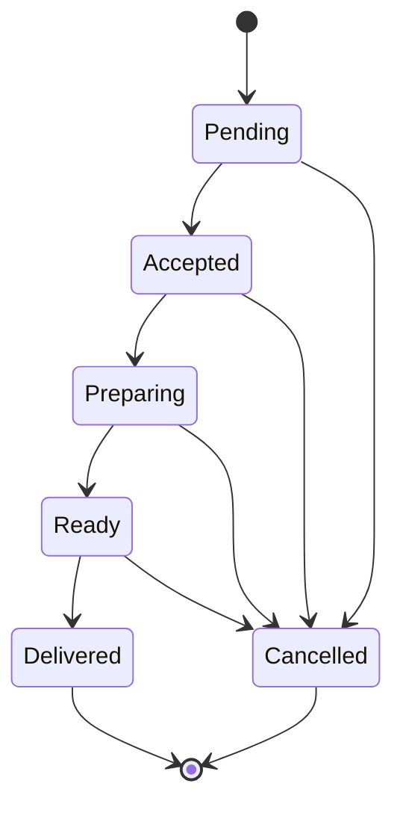

# Order Service — Technical Documentation

This document describes the technical details of the Order Service in SmartCafe.

---

## Overview

The Order Service manages customer orders for each cafe, including order creation, item selection, customization, status updates, and eventing.

---

## API Endpoints (Example)

- `GET /cafes/{cafeId}/orders` — List orders for a cafe
- `POST /cafes/{cafeId}/orders` — Create a new order (includes `tableId`)
- `GET /cafes/{cafeId}/orders/{orderId}` — Retrieve order details
- `PUT /cafes/{cafeId}/orders/{orderId}` — Update order (e.g., modify items, cancel)
- `POST /cafes/{cafeId}/orders/{orderId}/status` — Update order status

---

## Data Model (Simplified)

- **Order**: id, cafeId, tableId, customerId, menuId, items[], status, createdAt, updatedAt
- **OrderItem**: id, orderId, itemId, name, price, quantity, ingredientOptions[]
- **OrderStatus**: Pending, Accepted, Preparing, Ready, Delivered, Cancelled

---

## Request/Response Examples

### Create Order

Request:

```json
{
	"tableId": "T-12",
	"menuId": "MENU-001",
	"items": [
		{
			"itemId": "ITEM-123",
			"quantity": 2,
			"ingredientOptions": {
				"exclude": ["onion"],
				"include": []
			}
		}
	]
}
```

Response:

```json
{
  "orderId": "ORD-10001",
  "status": "Pending"
}
```

### Change Order Status

Endpoint: `POST /cafes/{cafeId}/orders/{orderId}/status`

Request:

```json
{
  "status": "Accepted"
}
```

Notes:

- Deleting orders is not supported; use status changes (e.g., `Cancelled`).
- Validate allowed transitions (e.g., Pending → Accepted → Preparing → Ready → Delivered; any → Cancelled with business rules).

---

## Order Lifecycle

- Orders progress through statuses: Pending → Accepted → Preparing → Ready → Delivered → Cancelled
- Customers receive real-time status updates via frontend

---

## Status Transition Rules

Allowed transitions (MVP):

| From      | To         | Notes                                    |
|-----------|------------|------------------------------------------|
| Pending   | Accepted   | After cafe acknowledges the order        |
| Pending   | Cancelled  | Cancelled by customer or timeout         |
| Accepted  | Preparing  | Work starts in the kitchen               |
| Accepted  | Cancelled  | Cancelled by cafe/customer with reason   |
| Preparing | Ready      | Order is prepared and waiting for pickup |
| Preparing | Cancelled  | Exceptional cases only                   |
| Ready     | Delivered  | Handed to customer                       |
| Ready     | Cancelled  | Exceptional cases only                   |

Terminal states: Delivered, Cancelled.

State diagram:



---

## Eventing

- Order events (created, updated, status changed) are published to Azure ServiceBus for integration with other services

---

## Security & Access

- Role-based access (customer, cafe staff) planned for future releases
- For MVP, endpoints are open for demonstration purposes

---

## References

- [Architecture Overview](README.md)
- [Menu Service Technical Docs](menu-service.md)
- [Business Domain](../10-business-domain/orders.md)
